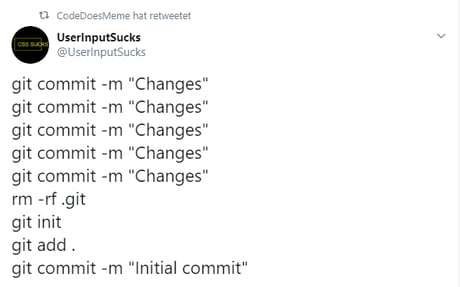

# Server
Go to the **server** folder and run the `docker compose up` command in bash.

``` bash
docker compose up
```

# Client
Launch and start from the **MainMenu** scene.

# Config
- For now, unit configs can only be changed from their prefabs.

## Note
- For matchmaking, at least two devices are required.


# It was like this :))

